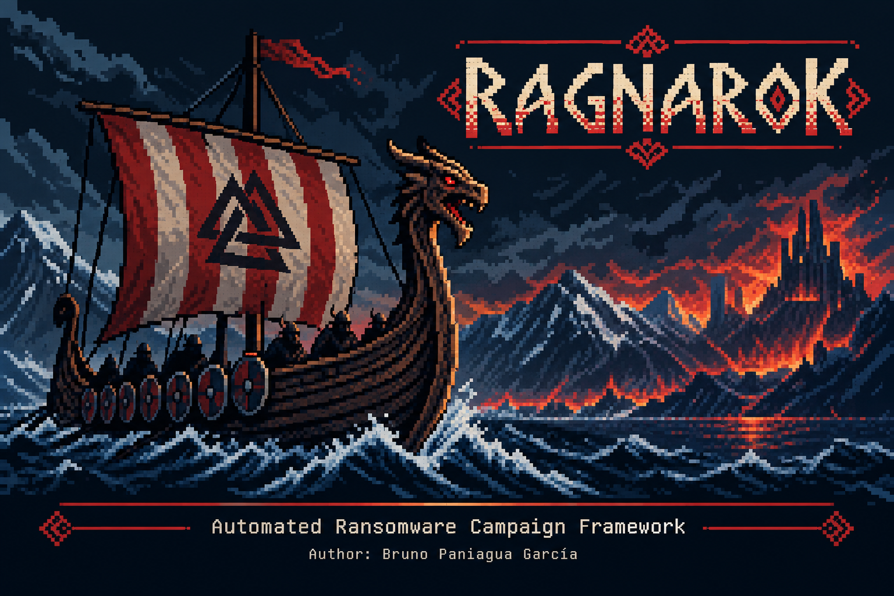
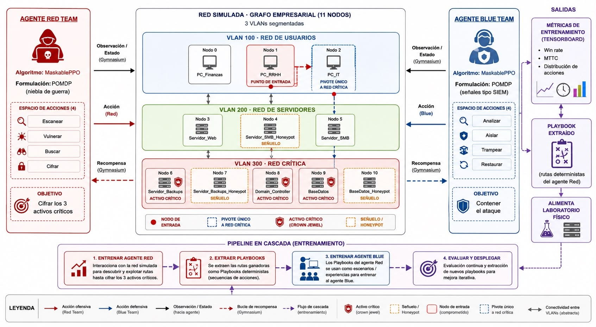
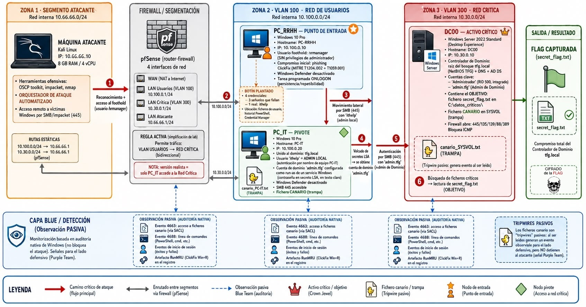

  <p align="center">
    
  </p>

# Co-design of Red-Blue Team Agents with Artificial Intelligence : Reinforcement Learning for Ransomware in Purple Team Environments

> Bachelor's Thesis (TFG) · Telecommunications Engineering
> Training offensive (Red) and defensive (Blue) reinforcement-learning agents over a
> simulated enterprise network, validated end-to-end on a physical Active Directory lab.


*The thesis document is written in Spanish; all code and documentation in this repository are in English, with some exceptions.*

---

## 🎥 Demo

[](https://www.youtube.com/watch?v=8eahC8lvH2o)

A full autonomous intrusion campaign — from initial access to Domain Controller
compromise — executed by the RAGNAROK orchestrator on the physical lab.

---

## Table of contents

- [Overview](#overview)
- [Architecture](#architecture)
- [Repository structure](#repository-structure)
- [The two subprojects](#the-two-subprojects)
- [Physical lab](#physical-lab)
- [Results](#results)
- [Tech stack](#tech-stack)
- [Disclaimer](#disclaimer)
- [Author](#author)
- [License](#license)

---

## Overview

This project explores whether **reinforcement learning** can automate both sides of a
Purple Team exercise. It has two complementary halves:

1. **Simulated environment (`simulacion-rl/`)** — An enterprise network modelled as an
   11-node graph segmented into three VLANs. Two agents are trained with **MaskablePPO**:
   a **Red** agent (offensive, POMDP formulation with fog-of-war) that learns to compromise
   the network's crown jewels, and a **Blue** agent (defensive, POMDP formulation with
   SIEM-like signals) that learns to contain it. The two are linked by a **cascade
   pipeline**: the Red agent is trained first, its winning routes are extracted as
   deterministic *playbooks*, and those playbooks train the Blue agent.

2. **Physical lab (`ragnarok/`)** — A real, segmented Active Directory lab where
   **RAGNAROK**, a deterministic ransomware orchestrator, reproduces the attack
   chain the Red agent discovered. It serves as the *expert baseline* against which the
   learned policy is compared, and it validates that the modelled threat is real and
   reproducible.

The guiding idea throughout: **the deterministic method is the design** — it is the
baseline the learned agents are measured against — while the specific answers of the
environment (credentials, domain names) are *discovered*, not hardcoded.

---

## Architecture



---

## Repository structure

```
tfg-purple-team-ai/
├── ragnarok/            # Deterministic adversary-emulation orchestrator (physical lab)
│   └── README.md
├── simulacion-rl/       # Reinforcement-learning environment and Red/Blue agents
│   └── README.md
├── docs/                # Thesis document, diagrams and images
│   └── img/
├── LICENSE
└── README.md            # (this file)
```

---

## The two subprojects

| Subproject | What it is | Details |
|---|---|---|
| 🧠 **[Simulación RL](simulacion-rl/)** | RL environment + Red & Blue MaskablePPO agents + cascade pipeline | [simulacion-rl/README.md](simulacion-rl/README.md) |
| ⚔️ **[RAGNAROK](ragnarok/)** | Deterministic ransomware orchestrator for the physical AD lab | [ragnarok/README.md](ragnarok/README.md) |

---

## Physical lab



A VirtualBox environment routed by **pfSense** into three VLANs (users, servers, critical
network). The attack path validated end to end is **PC_RRHH → PC_IT → Domain Controller**,
starting from a **ClickFix** initial-access vector (MITRE ATT&CK
[T1204.004](https://attack.mitre.org/techniques/T1204/004/) + T1059.001).

---

## Tech stack

**AI/RL:** Python · Gymnasium · Stable-Baselines3 (MaskablePPO / sb3-contrib) · PyTorch · TensorBoard · NetworkX
**Offensive tooling:** impacket · nmap · Active Directory · SMB · pass-the-hash
**Infrastructure:** VirtualBox · pfSense · Windows Server · Kali Linux

---

## Disclaimer

This project was developed strictly for **academic and research purposes** within an
**isolated, self-owned laboratory**. The offensive tooling here is intended for authorized
security testing and education only. Do not use it against systems you do not own or lack
explicit permission to test. The author assumes no liability for misuse.

---

## Author & Supervisor

**Bruno Paniagua García** — Telecommunications Engineering, specializing in Cybersecurity & AI
**José Antonio Gómez Hernández, PhD** — Associate Professor UGR, Department of Computer Languages ​​and Systems

- GitHub: [@bruno-paniagua](https://github.com/bruno-paniagua)
- LinkedIn: `www.linkedin.com/in/bruno-paniagua-garcía`
- Email: `brunopaniaguagarcia@gmail.com`

---

## License

Released under the [MIT License](LICENSE).
