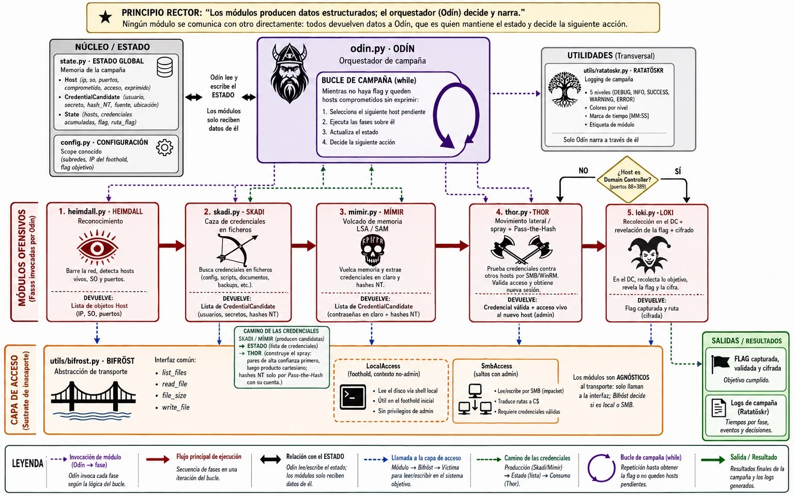
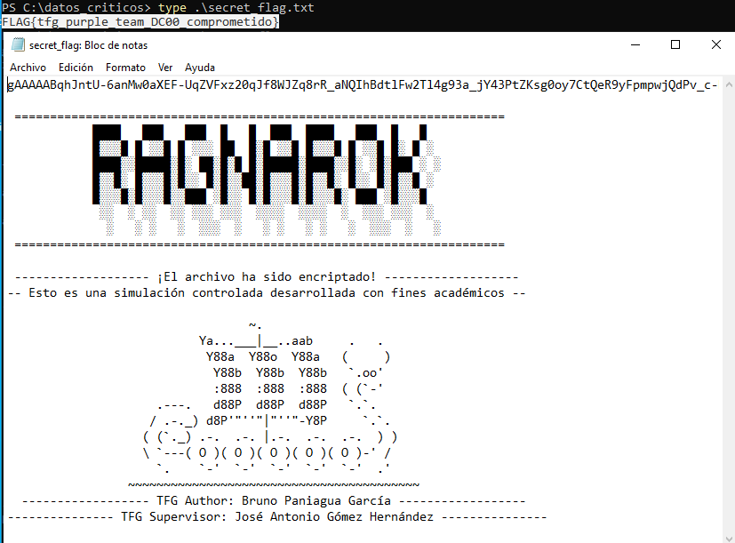

 <p align="center">
    
  </p>

# 𓊝 RAGNAROK — Deterministic Ransomware Orchestrator


RAGNAROK is a modular, deterministic **attack orchestrator** written in Python that runs a
full ransomware chain against an Active Directory lab — reconnaissance, credential hunting,
memory/LSA dumping, pass-the-hash lateral movement, Domain Controller compromise and encryption. —
completely autonomously. It is the **expert-playbook baseline** for the *Purple Team AI*
thesis and the component that runs on the physical lab.

Each module is named after a Norse deity whose myth mirrors its function.

---

## Design principle

> **Modules produce structured data; the orchestrator (Odin) decides and narrates.**
>
> **Scope is configured; identity and secrets are discovered.**

No module talks to another. Every module has a single responsibility and returns an
object to Odin, who owns the campaign state and decides the next action. This keeps each
piece testable and defensible in isolation.

---

## Architecture & data flow



---

## Modules (the Norse pantheon)

| Module | Deity | Role | Responsibility |
|---|---|---|---|
| `odin.py` | **Odin** | Allfather | Orchestrator: campaign loop, global state, decisions & narration |
| `modules/heimdall.py` | **Heimdall** | The all-seeing watchman | Reconnaissance: host discovery, OS, ports & services |
| `modules/skadi.py` | **Skadi** | Goddess of the hunt | Credential hunting in plaintext files |
| `modules/mimir.py` | **Mimir** | His head whispers hidden knowledge | Credential dumping from memory (LSA / SAM) |
| `modules/thor.py` | **Thor** | The hammer that strikes | Lateral movement: credential spray + pass-the-hash |
| `modules/loki.py` | **Loki** | The trickster | Looting, flag revelation on the Domain Controller & encryption |
| `utils/bifrost.py` | **Bifröst** | The bridge between worlds | Access layer: abstracts *how* each host is reached |
| `utils/ratatoskr.py` | **Ratatöskr** | The messenger squirrel of Yggdrasil | Structured, colored, timestamped logging |

`state.py` (campaign state) and `config.py` (lab scope) are infrastructure, not actors.

---

## The attack chain

The campaign runs as a `while` loop in Odin. Each iteration takes one compromised,
not-yet-exploited host and applies the phases to it:

```
Foothold (PC_RRHH, post-ClickFix)
   │
   ├─ HEIMDALL  → discover neighbours, OS, ports  (DC identified by ports 88 + 389)
   ├─ SKADI     → hunt credentials in files       → CredentialCandidate
   ├─ MIMIR     → dump LSA/SAM (admin hosts only)  → cleartext + NT hashes
   ├─ THOR      → spray the loot over SMB          → validated credential + live access
   └─ LOKI      → (on the DC) loot & reveal the flag
```

The **access layer (Bifröst)** is what makes this work: Skadi, Mimir, Thor and Loki are
**transport-agnostic** — they only call `list_files` / `read_file` / `file_size` /
`write_file`, and Bifröst decides whether that means a local read on the foothold or an
SMB operation on a remote admin host.

### MITRE ATT&CK mapping

| Phase | Technique |
|---|---|
| Initial access (ClickFix) | T1204.004 · T1059.001 |
| Discovery | T1046 · T1018 |
| Credential access (files) | T1552.001 |
| Credential access (LSA/SAM) | T1003.001 · T1003.002 |
| Lateral movement | T1021.002 · T1550.002 (pass-the-hash) |

---

## Requirements

```
pip install -r requirements.txt
```

Main dependency: **impacket** (SMB operations). Reconnaissance uses the system `nmap`
binary via `subprocess`. Requires root for SYN scans and OS fingerprinting
(`sudo python3 odin.py`).

---

## Usage

> ⚠️ Runs only against the **isolated, self-owned lab** it was built for. See the
> disclaimer below.

```bash
sudo python3 odin.py
```



---

## Disclaimer

Built strictly for **academic research** inside an **isolated lab**. For authorized
security testing and education only. Do not use against systems you do not own or lack
explicit permission to test.

---

← Back to the [main project README](../README.md)
