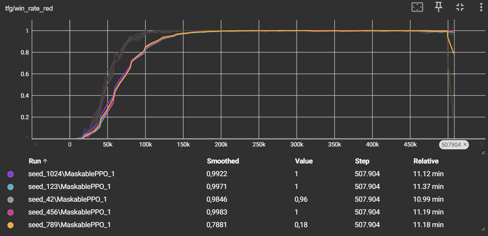
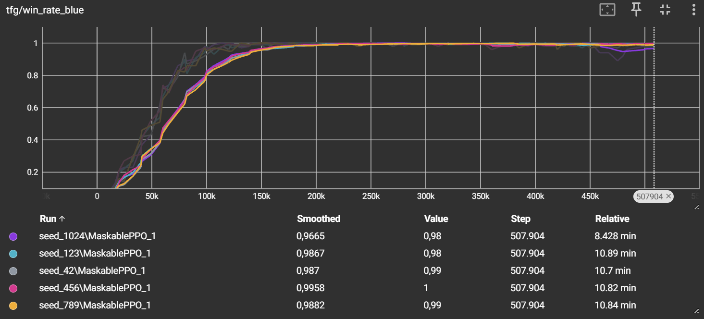
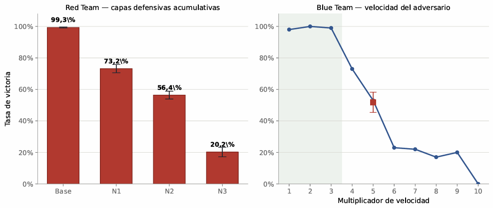

# 🧠 Purple Team AI — Reinforcement Learning Simulation


The simulated half of the thesis: an enterprise network modelled as a graph, on which two
reinforcement-learning agents — one offensive, one defensive — are trained with
**MaskablePPO** and linked by a cascade pipeline.

---

## The environment


An enterprise network modelled as an **11-node graph** segmented into **three VLANs**:

- **VLAN 100 · Users** — normal workstations + the initial foothold.
- **VLAN 200 · Servers** — web/SMB servers, including a honeypot decoy.
- **VLAN 300 · Critical network** — the crown jewels (Backups, Domain Controller,
  Database) plus honeypot decoys.

Only one host in the user network pivots into the critical network, forcing a realistic
multi-hop attack path.

---

## The agents

Both agents use **MaskablePPO** (action masking to forbid invalid actions) and the
**Gymnasium** interface (observation → action → reward).

| | 🔴 Red agent | 🔵 Blue agent |
|---|---|---|
| Formulation | POMDP with fog-of-war | POMDP with SIEM-like signals |
| Actions | Scan · Exploit · Search · Encrypt | Analyze · Isolate · Deceive · Restore |
| Objective | Encrypt the 3 critical assets | Contain the attack |

---

## The cascade pipeline

The two agents are trained in sequence, not in isolation:

```
Train Red agent  →  extract its winning routes as deterministic "playbooks"
                 →  use those playbooks to train the Blue agent
```

This is also what links the simulation to the physical lab: the invariant shortest path
to the DC that the Red agent discovers across all seeds is the backbone that the
deterministic **RAGNAROK** orchestrator reproduces on real infrastructure.

---

## Scripts

| Script | Purpose |
|---|---|
| `graf_arq_11nodes.py` | Definition of the 11-node network graph / topology |
| `definitivo_red.py` | Final Red agent — environment, training and evaluation |
| `definitivo_blue.py` | Final Blue agent — environment, training and evaluation |
| `hard_red_level1.py` · `hard_red_level2.py` · `hard_red_level3.py` | Progressively hardened Red adversaries used to train/stress the Blue agent |
| `hard_blue.py` | Hardened Blue configuration |

---

## Trained models

Pre-trained checkpoints are included (small `.zip` files), organized by configuration and
random seed for reproducibility:

```
modelos_red_def/        modelos_red_nivel1/   modelos_red_nivel2/   modelos_red_nivel3/
modelos_blue_def/       modelos_blue_nivel0/
   └── seed_42/ · seed_123/ · seed_456/ · seed_789/ · seed_1024/
          ├── best_model.zip     # best checkpoint during training
          └── final_model.zip    # final checkpoint
```

Multiple seeds are provided so results can be reproduced and averaged (the thesis reports
metrics across seeds).

---

## Results

Both agents perform near-optimally in their training conditions: Red encrypts all three
crown jewels in >99% of episodes, and Blue neutralizes almost every adversary playbook.
Metrics are tracked with TensorBoard and averaged over five seeds.

### Red agent — learning to compromise


### Blue agent — learning to contain


### Robustness under hardening

The interesting question is **robustness**: how far each policy holds when the problem is
hardened. Each configuration is retrained from scratch with identical hyperparameters, so
any degradation is attributable to the environment, not to retuning.

**Red — cumulative defense hardening.** The offensive policy is stress-tested against
three cumulative defensive layers:

| Level | Added defense | Red win rate |
|---|---|---|
| Baseline | Static environment | 99.3% |
| Level 1 | Dynamic honeypots (randomized each episode) | 73.2% (±2.6) |
| Level 2 | + SOC detection pressure | 56.4% (±2.5) |
| Level 3 | + reactive defender (*mini-Blue* isolating nodes) | 20.2% (±3.0) |

The *mini-Blue*'s direct containment is **zero**: it degrades the attacker by breaking
learned routes and forcing re-exploration, amplifying the passive layers. Level 3's
collapse is a synergy, not a sum.

**Blue — adversary speed (breakout time).** The defensive policy is stress-tested along a
single axis: the adversary's operational speed. It holds up to ×3, breaks sharply between
×3 and ×4 (99% → 73%), and collapses beyond that. Two negative controls (SIEM alert
fatigue and finite isolation capacity) left it untouched — the learned defense is a
**sequential interception**, not a parallel shield; speed is the only causal variable.

### Two different fragilities


The two agents degrade in fundamentally different ways, and that contrast is itself a
result: **Red** is fragile to the *superposition* of defenses (cumulative), while **Blue**
is fragile to a *single* factor (the adversary's speed).

> *The defense holds against yesterday's adversary speed and yields to tomorrow's.*

---

## Requirements & usage

```bash
pip install -r requirements.txt
```

Key dependencies: `stable-baselines3`, `sb3-contrib` (MaskablePPO), `gymnasium`,
`torch`, `networkx`, `tensorboard`.

```bash
# Train (example)
python definitivo_red.py
python definitivo_blue.py

# Visualize metrics
tensorboard --logdir runs/
```

> Note: training logs (TensorBoard event files, several GB) are **not** included in the
> repository — only the trained models. Regenerate them by running the training scripts.

---

← Back to the [main project README](../README.md)
